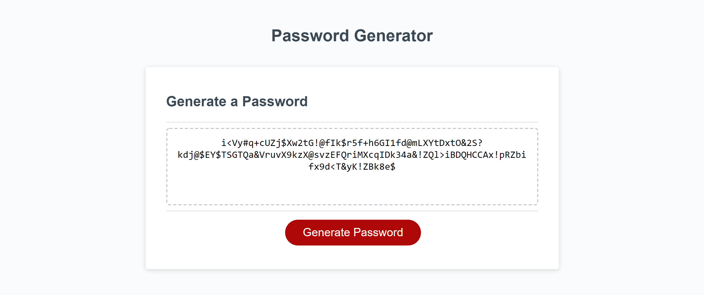

# Password-Generator

## Description
For this assignment we were asked to write the JavaScript code for a functioning password generator.

## Installation
* The first thing I did was set up the prompt, confirm, and alert boxes
* Then I set up a counter that would log the answers to the password criteria questions   to ensure the user selects at least two before they can continue
* After I had the counter set up I made an alert that would let the user know they didn't meet the password criteria   and added a return to run the "askforoptions" function again
* Once I had the criteria set up I made a series of "if" statements to concatenate arrays of characters based off the user selections 
* When that was done I set up a for loop using Math.random to select a random group of characters from the aforementioned array
* After I had my new array of characters from the for loop I joined them into a string to be displayed in the password box

## Technologies Used
* JavaScript
* Git Bash
* GitHub

## Author
* Tyler Davis &nbsp; | &nbsp; [GitHub](https://github.com/Twdavis85)

## Review URL
[GitHub](https://github.com/Twdavis85/Password-Generator) &nbsp; | &nbsp; 
[Live](https://twdavis85.github.io/Password-Generator/)

#

